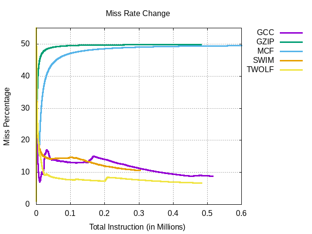
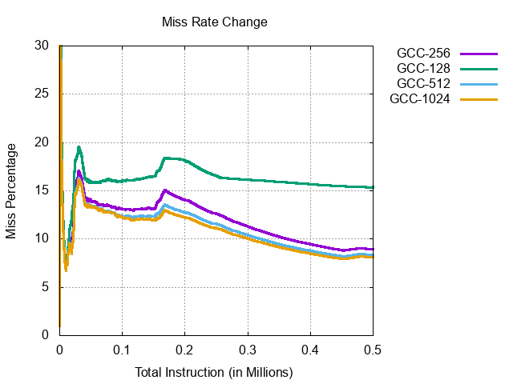

# Direct Mapped Cache

It is a designed implementation of Direct Mapped Cache in Verilog.  
The cache is designed to hold 256 BLocks, each containing 16 words (words = 32-bits), with 32-bit address line 

## Plot (Miss Rate vs Number of Compiler instructions)

This plot is showing how miss rate for a specific compiler varies with number of instructions given it to run

This plot is analysis of how "miss rate" change with varying number of blocks in the cache for GCC compiler 
## Collaborators
1. [`Nithin Raj`](https://github.com/nithinr07)
2. [`R Arvind`](https://github.com/r-arvind)
